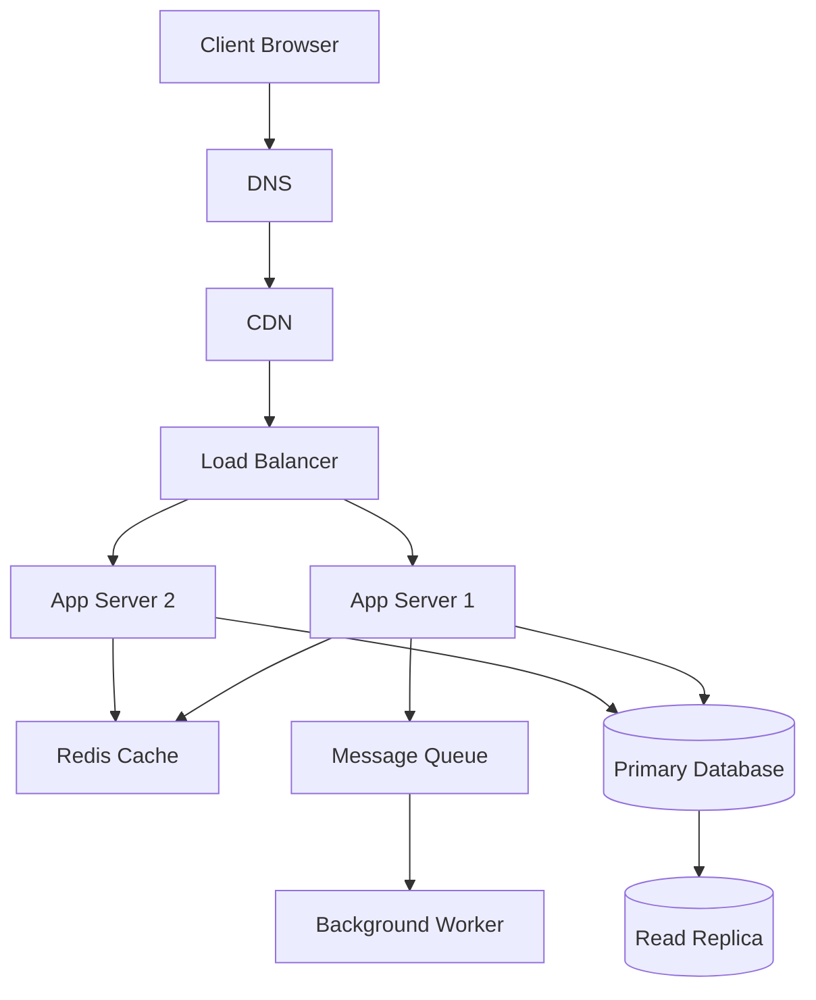

# QuickNotes System Architecture

## Requirements

- **Functional Requirements**: User authentication, CRUD operations for notes, a tagging system for categorization, and full-text search functionality.
- **Non-Functional Requirements**: 99.9% system availability, API response latency of less than 200ms, support for 1 million concurrent users, and strict data durability.

## Load Estimates (1 Million Users)

- **Reads per second**: ~5,000 req/s (Assuming an average of 10 reads per user per day).
- **Writes per second**: ~500 req/s (Assuming an average of 1 write per user per day).
- **Storage per year**: ~50 GB (Assuming an average note size of 1KB plus metadata and indexes).

## Architecture Diagram

## Component Explanations
- Client: Solves the problem of user interaction by providing the visual interface and capturing user inputs.
- DNS: Solves the problem of human memorability by translating domain names into IP addresses for network routing.
- CDN: Solves the problem of high latency and origin server overload by caching static assets globally close to the user.
- Load Balancer: Solves the problem of single-server overload and downtime by distributing incoming traffic evenly across multiple healthy app servers.
- App Servers: Solve the problem of processing business logic and API requests without being tied to a specific user's session state.
- Cache (Redis): Solves the problem of slow database read times by storing frequently accessed data in ultra-fast memory.
- Primary Database: Solves the problem of data durability and consistency by acting as the single source of truth for all write operations.
- Read Replica: Solves the problem of read-heavy traffic bottlenecking the primary database by offloading read queries.
- Message Queue: Solves the problem of slow API response times caused by heavy background tasks by decoupling them from the main request flow.
- Background Worker: Solves the problem of blocking the main application thread by processing asynchronous tasks pulled from the queue.

## Request Flows
**Flow for GET /notes**
1. The Client requests /notes via the CDN.
2. The Load Balancer routes the request to an available App Server.
3. The App Server checks the Redis Cache for the user's recent notes.
4. If there is a cache miss, the App Server queries the Read Replica database.
5. The data is returned to the Client and cached in Redis for subsequent requests.

**Flow for POST /notes**
1. The Client submits new note data via the API.
2. The Load Balancer routes the request to an App Server.
3. The App Server validates the input and writes the new note to the Primary Database.
4. The App Server invalidates the relevant Redis Cache keys to ensure data consistency.
5. The App Server pushes a "note created" event to the Message Queue (e.g., for search indexing).
6. A success response is returned to the Client immediately.

## Trade-offs
- Caching vs. Consistency: Using Redis drastically improves read latency but introduces a brief window of stale data immediately following a write operation. Mitigation: Implement strict, synchronous cache invalidation strategies on all write operations to minimize this window.
- Synchronous vs. Asynchronous Processing: Offloading tasks to a Message Queue improves API response times but adds system complexity and potential delivery delays for background tasks. Mitigation: Use dead-letter queues and automated retry policies to ensure no tasks are permanently lost.

## Single-Point-of-Failure (SPOF) Avoidance
- App Servers: The Load Balancer ensures that if one App Server crashes, traffic is instantly routed to the remaining healthy servers, preventing a total API outage.
- Database: The Read Replica ensures the Primary Database isn't overwhelmed by read traffic, while database clustering ensures data survives a primary node failure.
- Infrastructure: Deploying all components across multiple Availability Zones (Multi-AZ) protects the entire system against physical data center outages.